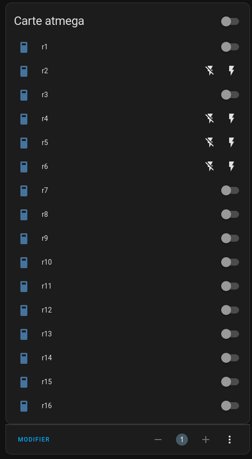

merci a dusnoki pour le code @https://github.com/dusnoki/arduino-mqtt-21-channel-relay-driver
c'est pas une inspiration c'est du pompage pur et dur avec quelques modifs insignifiantes de ma part ;-)

2025: un minimum de motivation et un maximum de chatGPT pour une nouvelle fournée 2025 - a tester !

# 16-relay-mqtt-domotic-board
carte domotique 16 sorties piloté par 16 entrées et/ou par mqtt ,compatible Home-Assistant Node-Red ou autres.
oui je sais il n y a pas de relais sur la carte relais ( ça serais plus une carte de pilotage de relais du coup !)

La carte eclectronique fait 10cm de coté ce qui fait que chez certain fabrican de pcb le prix est tres interessant! :-D

